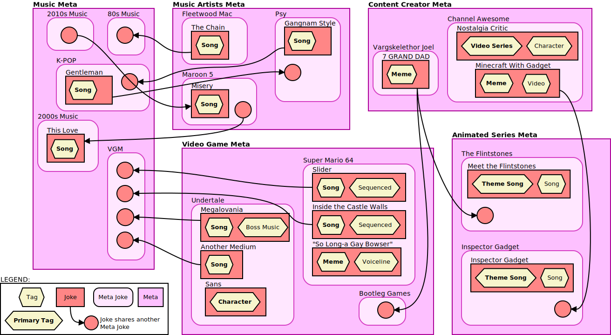

# The Rip Database Project

This project aims to provide an easy way to catalog and find "[rips](#what-are-rips)" uploaded by all "ripping" channels on YouTube.

It is a PHP and MySQL based system that is currently hosted on [ripdb.net](https://ripdb.net), but can be entirely self-hosted should you want an offline copy.  
See [the releases page](https://github.com/Mr-Kaos/The-Rip-DB/releases) for stable releases of the site along with a full dump of the database (excluding all credentials and stuff of course).

## Table of Contents:

- [Aim of the Project](#aim-of-the-project)
- [Local Setup/Install](#local-setupinstall)
- [Project Features and Plans](#project-features-and-plans)
- [System Design](#system-design)

## Aim of the Project

The goal of this project is to provide a complete and detailed database of all rips that exist publicly on the internet. Each rip will be given appropriate tags and attributes, to help fid rips by their contents, such as the songs used, jokes and references within the rip or other meta information related to the rip.

Ultimately, if someone wanted to find rips that contain certain songs or references, they would be able to do it here.

Some examples of what the database should be able to do:

- If someone wanted to find all rips that contain a song by "Daft Punk", they should be able to search for that.  
- If someone wanted to find all rips that are from the video game "Undertale", the database should contain the data to do this.
- If someone wanted to find all rips that are "melody swaps" (a video game track in another game's soundfont or style), the database should provide this data.
- If someone wanted to find all rips by the channel "SiIvaGunner uploaded between May 2017 and May 2018, the database will provide this.

## Local Setup/Install

If you want to set this database up locally (with or without sample data), follow the steps below:

Ensure you have the following dependencies too:

- PHP 8.1 or newer (Tested with PHP 8.3.2)
- Composer for PHP
  - FlightPHP
  - PicoDB (>= 6.0.1)
- MySQL 8.0.41 or newer (Tested with 8.0.41)

To install and run locally:

1. Clone this repository `git clone https://github.com/Mr-Kaos/The-Rip-DB.git`
   > *The password is left blank in this file, so be sure to fill it in!*
2. Navigate to the file `site/private_core/config/` and copy the file `db-template.php` to `db.php`.  
3. Edit the file `db.php` and set its database constants to suit your database setup.  
   > *The password is left blank in this file too!*
4. In the terminal, navigate to the `sql` directory and run the command `php install.php`. This will deploy the database for you.  
   > **Optional:** When running this command, after the database is deployed, it will prompt to ask if you want to deploy sample data. Type `y` and press enter to insert some sample data.
5. In the terminal, move into the `site` directory and run `composer update` to download the two PHP dependencies.
6. Finally, in the same directory in the terminal, use `php -S localhost:8080` to run the site locally.

A more detailed (and automated) guide will be produced as the project progresses.

## Project Features, Plans and Versions

The primary goal of this project is to provide a complete and detailed database that allows users to search for a rip based on its contents, i.e. tags. This will also be crowd sourced, meaning anyone can contribute to fill in any gaps of information that this database is missing.

This project has the following planned features complete:

<table>
<thead><tr><th>RipDB</th><th>RipGuessr</th></tr></thead>
<tbody>
<tr><td>

- [X] Core data structure
  - [X] Rips
  - [X] Rip categories/metadata
    - [X] Jokes
    - [X] Meta Jokes
    - [X] Metas
    - [X] Tags
    - [X] Channels
    - [X] Games
  - [ ] Extra Features
    - [X] Playlists
    - [X] Accounts
    - [X] YouTube Playlist Import
    - [ ] Playlist player
    - [ ] Wiki links/references
- [X] Data Search
  - [X] Search filters
  - [X] Page sorting
- [ ] RESTful API
- [ ] Mobile support (layout)

</td><td>

- [X] Core game backend/design
- [X] Complete gameplay loop
- [ ] Modular Game settings
  - [ ] Difficulty options
    - [X] Difficulty presets
    - [ ] Granular difficulty options
  - [ ] Rip selection filters
    - [X] Filter by meta jokes
    - [X] Filter by metas
    - [ ] Filter by channel
    - [X] Filter from playlist
- [ ] Multiplayer sessions
- [ ] Mobile support (layout)

</td></tr>
</table>

### Note Regarding Version Numbers:

While the project is in its Beta phase, all major new features will be released as a new minor version, with minor additions and bug fixes as the patch number.  
Once all planned features are complete and functional, Version 1.0.0 will be released.

## System Design

This system is based around rips and their data. All rips are stored in a central table, with the data to help identify rips stored in their own tables (jokes and tags tables).

The ER diagram below outlines the system's design and how each component communicates with each other.

### Relations Between Rips, Jokes, Metas and Tags

Rips and their jokes are the primary focus of this database. To make it easy for different rips to share the same jokes and attributes, a hierarchy of attributes is used to organise rips and their jokes. The hierarchy is as follows, from most broad to most specific:

1. Meta
2. Meta Joke
3. Joke
4. Tag

**Metas** are used to organise **Meta Jokes**.  
**Meta Jokes** are used to categorise **Jokes**.  
**Jokes** are used to categorise rips.
**Tags** are used to provide specific, but general information about a joke. e.g. if the joke is a song, the tag of "Theme Song" can be given to specify that the joke is a theme song.

The diagram below illustrates how some potential metas, meta jokes, jokes and tags are related to each other.

## What are "Rips"?

In case you are unfamiliar with rips, the term "Rips" generally refers to a bait-and-switch video that advertises a particular track from a video game's soundtrack, but is instead an altered version of said track, often a mashup, remix or rendition.

Some of the most notable channels that upload rips are [SiIvaGunner](https://www.youtube.com/@SiIvaGunner), [TimmyTurnersGrandDad](https://www.youtube.com/@TimmyTurnersGrandDad) and [Mysikt](https://www.youtube.com/@Mysikt).

There are other channels that have popped up over the years who also make rips, but often with less quality control and just to upload "joke" videos. While these may not be in the same spirit as traditional rips, these still aim to be cataloged.
